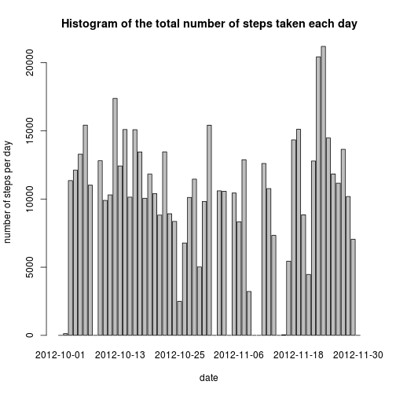
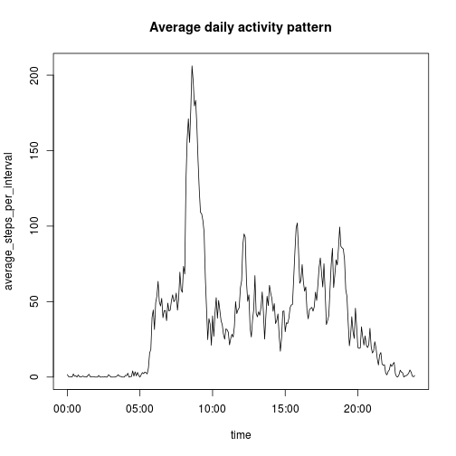
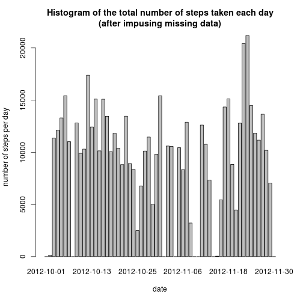
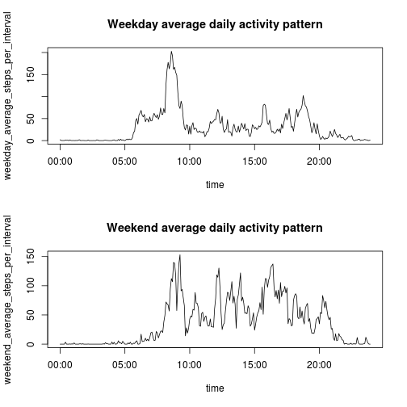

## Loading and preprocessing the data
First load the data from file "activity.csv".

```r
present = read.csv("activity.csv")
```

In addition to the original data frame, I add a new column called time. The time column includes the time for each "steps" of the data frame. The variable type of "time" is POSIXlt.

```r
time = as.POSIXlt(present$date)
time$min = time$min + present$interval %% 100
time$hour = time$hour + (present$interval - present$interval %% 100) / 100
present = cbind(present, time)
present$time = as.POSIXlt(present$time)
head(present)
```

```
##   steps       date interval                time
## 1    NA 2012-10-01        0 2012-10-01 00:00:00
## 2    NA 2012-10-01        5 2012-10-01 00:05:00
## 3    NA 2012-10-01       10 2012-10-01 00:10:00
## 4    NA 2012-10-01       15 2012-10-01 00:15:00
## 5    NA 2012-10-01       20 2012-10-01 00:20:00
## 6    NA 2012-10-01       25 2012-10-01 00:25:00
```

## What is mean total number of steps taken per day?

```r
steps_per_day = tapply(present$steps, present$date, sum, na.rm=TRUE)
par(bg="white")
barplot(steps_per_day, xlab = "date", ylab = "number of steps per day",
        main = "Histogram of the total number of steps taken each day")
```

 

From the following R code, we see that the mean and median total number of steps taken per day are 9354 and 10395 respectively.

```r
mean_steps_per_day = mean(steps_per_day)
median_steps_per_day = median(steps_per_day)
mean_steps_per_day
```

```
## [1] 9354
```

```r
median_steps_per_day
```

```
## [1] 10395
```

## What is the average daily activity pattern?
To record the specific time in a day for each record, a new column "dayTime" is added.

```r
dayTime = mapply(paste, present$time$hour, present$time$min, sep = ":")
record_per_day = nrow(present[present$date == present[1, 2],])
dayTime = factor(dayTime, dayTime[1:record_per_day])
present = cbind(present, dayTime)
head(present)
```

```
##   steps       date interval                time dayTime
## 1    NA 2012-10-01        0 2012-10-01 00:00:00     0:0
## 2    NA 2012-10-01        5 2012-10-01 00:05:00     0:5
## 3    NA 2012-10-01       10 2012-10-01 00:10:00    0:10
## 4    NA 2012-10-01       15 2012-10-01 00:15:00    0:15
## 5    NA 2012-10-01       20 2012-10-01 00:20:00    0:20
## 6    NA 2012-10-01       25 2012-10-01 00:25:00    0:25
```
Based on the column "dayTime", the average steps per interval among all days are stored in average_steps_per_interval.

```r
average_steps_per_interval = tapply(present$steps, present$dayTime, mean, na.rm = TRUE)
head(average_steps_per_interval)
```

```
##     0:0     0:5    0:10    0:15    0:20    0:25 
## 1.71698 0.33962 0.13208 0.15094 0.07547 2.09434
```

Finally the figure is plotted out.

```r
par(bg="white")
plot(present[1:288, 4], average_steps_per_interval, xlab = "time",
     main = "Average daily activity pattern", type = "l")
```

 

## Imputing missing values
"na_flag" is used to store the flags labeling each record has NA or not.

```r
na_flag = is.na(present$steps)
na_number = sum(na_flag)
```

Filling in all of the missing values in the data set, use the mean for that day.

```r
mean_steps_per_day = tapply(present$steps, present$date, mean, na.rm=TRUE)
mean_steps_per_day[is.nan(mean_steps_per_day) == TRUE] = 0
new_present = present
new_present[na_flag, 1] = mean_steps_per_day[new_present[na_flag, 2]]
head(new_present)
```

```
##   steps       date interval                time dayTime
## 1     0 2012-10-01        0 2012-10-01 00:00:00     0:0
## 2     0 2012-10-01        5 2012-10-01 00:05:00     0:5
## 3     0 2012-10-01       10 2012-10-01 00:10:00    0:10
## 4     0 2012-10-01       15 2012-10-01 00:15:00    0:15
## 5     0 2012-10-01       20 2012-10-01 00:20:00    0:20
## 6     0 2012-10-01       25 2012-10-01 00:25:00    0:25
```
Finally the figure is plotted.

```r
new_steps_per_day = with(new_present, tapply(steps, date, sum))
par(bg="white")
barplot(new_steps_per_day, xlab = "date", ylab = "number of steps per day",
        main = "Histogram of the total number of steps taken each day
(after impusing missing data)")
```

 

## Are there differences in activity patterns between weekdays and weekends?
A new column in the data frame is added to label if the day of a certain record is weekday or weekend.

```r
week_day_flag = c(rep("weekday", 5), rep("weekend", 2))
names(week_day_flag) = c("Monday", "Tuesday", "Wednesday", "Thursday", "Friday", "Saturday", "Sunday")
day_type = weekdays(new_present$time)
day_type = week_day_flag[day_type]
day_type = factor(day_type)
new_present = cbind(new_present, day_type)
head(new_present)
```

```
##   steps       date interval                time dayTime day_type
## 1     0 2012-10-01        0 2012-10-01 00:00:00     0:0  weekday
## 2     0 2012-10-01        5 2012-10-01 00:05:00     0:5  weekday
## 3     0 2012-10-01       10 2012-10-01 00:10:00    0:10  weekday
## 4     0 2012-10-01       15 2012-10-01 00:15:00    0:15  weekday
## 5     0 2012-10-01       20 2012-10-01 00:20:00    0:20  weekday
## 6     0 2012-10-01       25 2012-10-01 00:25:00    0:25  weekday
```

Split the data frame, and calculate average steps per interval among all weekdays and weekends respectively.

```r
two_present = split(new_present, new_present$day_type)
weekday_present = two_present[[1]]
weekend_present = two_present[[2]]

weekday_average_steps_per_interval = tapply(weekday_present$steps, weekday_present$dayTime, mean)
weekend_average_steps_per_interval = tapply(weekend_present$steps, weekend_present$dayTime, mean)
```

Finally the figure is plotted.

```r
par(mfrow = c(2, 1), bg = "white")
plot(present[1:288, 4], weekday_average_steps_per_interval, xlab = "time",
     main = "Weekday average daily activity pattern", type = "l")
plot(present[1:288, 4], weekend_average_steps_per_interval, xlab = "time",
     main = "Weekend average daily activity pattern", type = "l")
```

 


